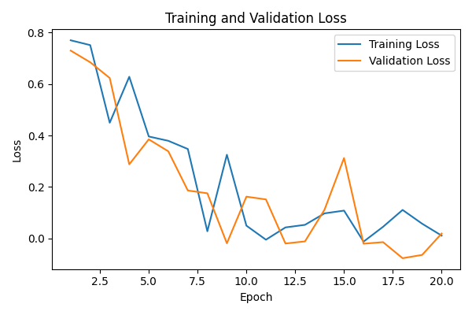
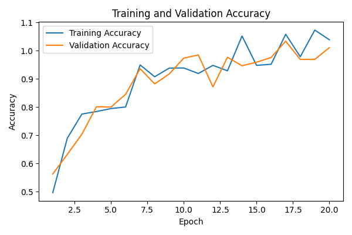

# Transformers Deep Learning Project

## Overview
This repository contains deep learning resources and code, primarily focused on Convolutional Neural Networks (CNNs) for image classification, as well as supporting reports and documentation for related coursework.

## Visualizations

### CNN Architecture

*Figure: Simple schematic of the Convolutional Neural Network used for binary classification.*

### Training and Validation Loss

*Figure: Example of training and validation loss curves over epochs.*

### Training and Validation Accuracy

*Figure: Example of training and validation accuracy curves over epochs.*

## Contents

- **CNN_PA_Finalversion.ipynb**: Jupyter notebook for a binary image classification task (dogs vs. cats) using a Convolutional Neural Network (CNN) with PyTorch. Includes data loading from Google Drive, model building, training, evaluation, and visualization of results.
- **CNN_PA_Finalversion_deepniti.ipynb**: Another version of the CNN notebook for the same dogs vs. cats classification task, with similar structure and requirements, possibly with different implementation details or experiments.
- **DLreport.pdf**: PDF report, likely summarizing the deep learning project, results, and findings. (Open with a PDF viewer for details.)
- **CSE676_RNN.pdf**: PDF document, likely related to coursework or reference material on Recurrent Neural Networks (RNNs). (Open with a PDF viewer for details.)

## How to Use

1. **Requirements**:
   - Python
   - PyTorch
   - Jupyter Notebook
   - (Optional) Google Colab for running notebooks with Google Drive integration

2. **Running the Notebooks**:
   - Download the dataset from the provided Google Drive link (see inside the notebooks for URLs).
   - Mount Google Drive if using Colab, or place the data in the appropriate local directories.
   - Open either `CNN_PA_Finalversion.ipynb` or `CNN_PA_Finalversion_deepniti.ipynb` in Jupyter or Colab.
   - Follow the instructions in the notebook to train and evaluate the CNN model.

3. **Reports**:
   - Open `DLreport.pdf` for a summary of the project and results.
   - Open `CSE676_RNN.pdf` for additional reference on RNNs.

## Notes
- The notebooks are designed for a binary classification task (cats vs. dogs) and require the dataset to be structured into `train`, `val`, and `test` folders.
- Ensure all dependencies are installed before running the notebooks.
- For any issues or questions, refer to the comments and instructions within each notebook.

---

*This README was auto-generated based on the contents of the repository. For more details, please refer to the individual files.* 